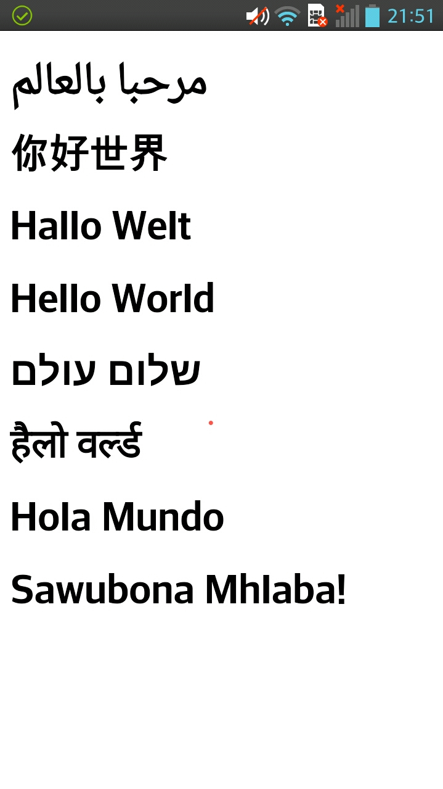

Part 1 - Hello World
====================

Introduction
------------
Everything is about going mobile today and so are we. We'll start with the mother of all programs: *Hello World*. For these of you who are unfamiliar with the concept: To get to know a new programming language or style it is common to start with a minimal proof-of-concept that just prints the words *Hello World*.

The web app
-----------
While "writing a mobile app" may sound like a complicated task there is in fact a simple but effective way: *PhoneGap/Cordova*. This web service by Adobe compiles your web app into an installable mobile app - for free! So all we need to do know is start with a simple web app. Web apps are basically a fancy name for a web page that exploits modern browser technologies like HTML5, CSS3 and ES6 (better known as JavaScript).

Let's write the most simple web app known to mankind:

    <!DOCTYPE html>
    <html>
    <head>
        <meta charset=utf-8 />
        <title>Hello World!</title>
        
    </head>
    <body>
        <h1 class="rtl">مرحبا بالعالم</h1>
        <h1>你好世界</h1>
        <h1>Hallo Welt</h1>
        <h1>Hello World</h1>
        <h1 class="rtl">שלום עולם</h1>
        <h1>हैलो वर्ल्ड</h1>
        <h1>Hola Mundo</h1>
        <h1>Sawubona Mhlaba!</h1>
    </body>
    </html>

That's it - I took the liberty to internationalize the app which let's test the Unicode capabilities of your smart phone. Now you copy that code into your favorite editor, save it under *index.html*. You may peek at the result it in your preferred browser.

As a next step we need upload the source to a *GitHub* repository. Alternatively you can just take my repository for the next step.

PhoneGap
--------
As we are going to use PhoneGap to build our app (<http://build.phonegap.com>) we first need to create an *Adobe ID*. See **Adobe1 - Adobe9** for step-by-step instructions.

Now we connect the builder to the *GitHub* repository. As noted above you can either use your own repository (**GitHub1** shows where to find the URL) or just take mine for now: `https://github.com/TutorialBer/MobileAppTutorial.git`.
If you didn't use the master branch alike me, you need to specify that as well (use `Example1` if you use my repository). The builder is ready to pull the code!

Take your time to give the app a nice name (e.g. *Hello World*) and you are ready to build (press the *Ready to build* button). Depending on the size of the app building will take a while, but finally apps for the WindowsPhone and Android should be available for downloading[1]. Scan that QR code at the upper left side of the page and - voilà - your phone will start a download and install your first mobile app.

Result
------
I'll just show you how it looks on my phone . I know, it neither does anything nor does it even look good, but we'll come to that in the next tutorial.

1) For iPhone users there is a drawback: Unless your are willing to enroll in Apple's Developers Program ($99/yr) can't build your own iPhone apps. This is not a limitation of PhoneGap. Due to Apples developer guidelines every app running on an (not jailbroken) iPhone needs to be signed digitally with a certificate issued only to members of that program. You can enroll with your Apple ID at <https://developer.apple.com/programs/ios>.
