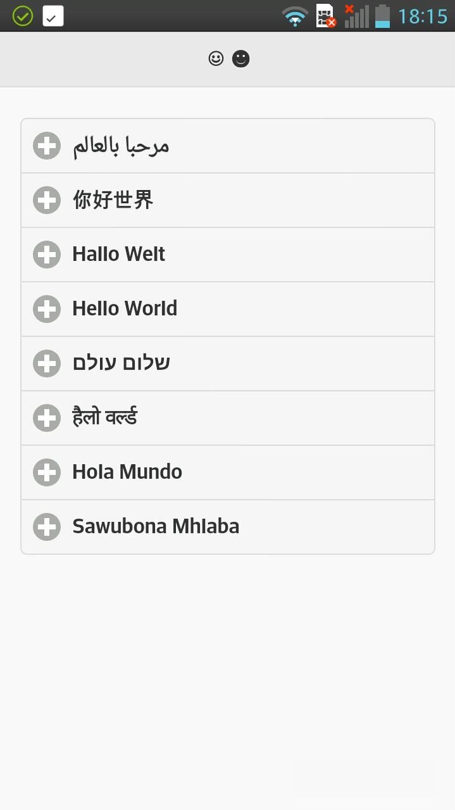

Part 2 - An even nicer "Hello to you all"
====================

Introduction
------------
In our last example I showed you how to write one of the most simple mobile apps - but it is also meager as planet Mars' surface.

So today I will show you how to make the whole app look like a real app and not just like an office posting.

Looking good now
----------------
Thankfully there are libraries that make styling a mobile web page quite easy. I will use the [jQuery Mobile framework](http://jquerymobile.com/) which is tightly bound to the famous *jQuery* javascipt library for easy DOM handling.
*jQuery Mobile* supports *Widgets* like buttons, title bars or lists that can be added by using div-elements that contain special `data`-attributes. Theses data-attributes are only legal for HTML5 documents which explains why our web pages need to be compliant to this standard.
The starting point for every app in *jQuery Mobile* is a *page*, which is exactly what it sounds: one of maybe multiple pages inside one HTML document.To declare a page you add:

    

    

to the documents body-tag. Every real app has a title bar that can be added easily, we'll keep it simple and use two smilies as our title text:

    

        <h2>☺ ☻</h2>
    

After these two examples it's probably obvious how to add a meaning to the div-elements using *jQuery Mobile* widgets using `data`-attributes.
To add some content, we solve the mystery of the multiple "Hello World" examples and show which language that example is in. Let's use a collapsible, basically an expandable list that shows more additional information after you *click* an item.

    

    

is the code for the list and every item is styled using the following markup:

     

        <h3>Visible item text</h3>
        
Hidden item text with additional information

    

Now we should not forget to add the main content which is styled inconsistently with the previous snippets:

    

    

But beside that exception we can just add the single parts together like LEGO® bricks. You find the complete document in the **Example2**-branch of the repository. Don't forget to add links to the css/js-files otherwise you'll still have an martian experience.

PhoneGap part II
----------------
In the last example I showed you how to use PhoneGap to build your mobile app, but this time we want to configure PhoneGap's build. You can either configure by opening the *settings* tab on the apps page

or by adding a `config.xml` file - which is exactly what we are going to do!
I will only discuss some of the preferences I added you can read further about the configuration file in [PhoneGap's documentation](http://docs.build.phonegap.com/en_US/configuring_basics.md.html).

First we want to add a customized icon.

    <icon src="icon.png" />

It's as easy as that, add an image to your root folder and name it accordingly. So let's add a splash screen as well:

    <gap:splash src="splash.png" width="320" height="480" />

You can specify different splash screens for different devices and platforms using the `width` and `height` attribute and by adding a `gap:platform` setting it to `ios`, `android` or `winphone` respectively.

You can also configure some details like the PhoneGap version (at least to get rid of the yellow sign above your app page that tells you it's not using the latest), the app's permissions - right now we don't need any - or that we don't need to hide the phones titlebar (`fullscreen` set to `false`). In further tutorials we'll come back to configuring our app e.g. to use plugins like the camera.

    <preference name="phonegap-version"           value="3.7.0" />
    <preference name="permissions"                value="none"/>
    <preference name="fullscreen"                 value="false" />

Check out my version of `config.xml` to see some other obvious features in the configuration file.

Finishing
---------
After adding the configuration and image files let PhoneGap pull the new version of your app and build it. Again I will leave you with a screen shot of the running app from my phone:

Next time we will add some functionality so the app actually does something.

Image copyright
---------------
The **mars surface** photo is courtesy of NASA/JPL-Caltech ([licence](http://www.jpl.nasa.gov/imagepolicy/)).

The **Grid World** icon made by [Yannick](http://www.flaticon.com/authors/yannick Yannick) from [www.flaticon.com](http://www.flaticon.com  Flaticon) is licensed under [CC BY 3.0](http://creativecommons.org/licenses/by/3.0/ Creative Commons BY 3.0).

The **Beginning of the end of the Space Shuttle program** photo from [Robert Scoble](https://www.flickr.com/people/scobleizer/) is licensed under [CC BY 2.0](http://creativecommons.org/licenses/by/2.0/deed.en).

